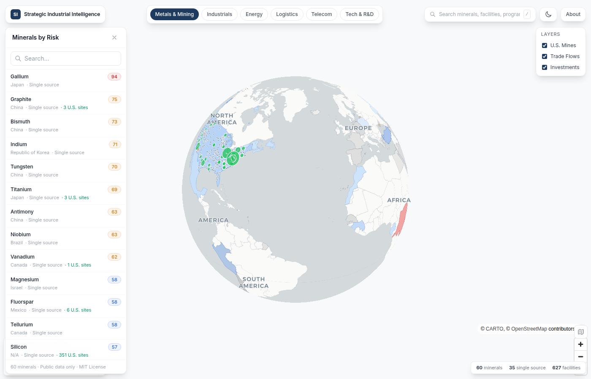
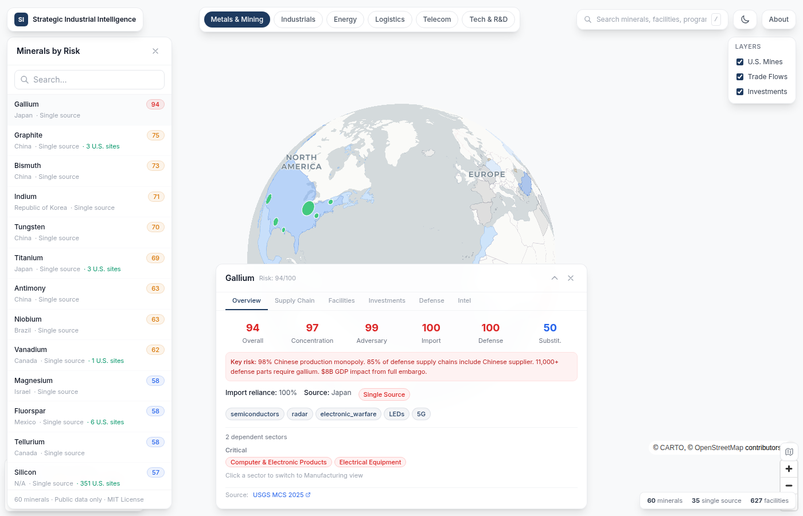

<p align="center">
  
</p>

<h1 align="center">Strategic Industrial Intelligence</h1>

<p align="center">
  <em>Open-source intelligence platform for U.S. industrial base health, critical mineral supply chains, and defense sector dependencies.</em>
</p>

<p align="center">
  <a href="https://strategic-intel-flax.vercel.app"></a>
  
  
  
  
</p>

<p align="center">
  <a href="https://strategic-intel-flax.vercel.app"><strong>Live Demo</strong></a> ·
  <a href="#features">Features</a> ·
  <a href="#quick-start">Quick Start</a> ·
  <a href="#architecture">Architecture</a> ·
  <a href="#data-sources">Data Sources</a> ·
  <a href="docs/METHODOLOGY.md">Methodology</a>
</p>

---

## What is this?

An analyst evaluating a $200M lithium processing investment. They need answers in 30 minutes: Where are existing U.S. facilities? What programs depend on lithium? Who controls the supply chain? What investments have already been made?

**Strategic Industrial Intelligence** is the fastest way to get oriented on a critical material or defense industrial base investment. It's a map-first dashboard that connects critical minerals, manufacturing capacity, energy infrastructure, maritime logistics, telecom systems, and defense technology — all from public government data.

<p align="center">
  <kbd></kbd>
</p>

## Features

### 6 Sector Lenses

| Lens | What It Shows | Data Points |
|------|-------------|-------------|
| **Metals & Mining** | 60 critical minerals with risk scores, supply chain stages, facility locations | 60 minerals, 627 U.S. mines, trade flow arcs |
| **Manufacturing** | 8 NAICS sectors with health scores, shipbuilding comparison, munitions production | 8 sectors, 17 defense programs, 311 material links |
| **Energy** | Power generation mix, grid challenges, battery mineral dependencies | 7 fuel types, 10 key facilities, 5 grid vulnerabilities |
| **Logistics** | Maritime chokepoints, port infrastructure, merchant fleet comparison | 8 chokepoints, 14 ports, strategic sealift assessment |
| **Telecom & Space** | Submarine cables, satellite constellations, 5G infrastructure | 8 cables, 8 constellations, vulnerability analysis |
| **Tech & R&D** | U.S. vs China technology competition, defense R&D spending | 10 technology areas, R&D by state |

### Intelligence Reports

**101 researched intelligence reports** covering every item in the platform. Each report includes:
- Executive summary
- 5-10 key findings with severity ratings and source URLs
- 3-8 recent developments (2024-2026)
- Risk assessment with trend direction
- Full source citations (417 total across all reports)
- One-click download as markdown

### Knowledge Graph

**1,021 entities** and **1,727 relationships** connecting minerals to defense programs, countries to production shares, investments to facilities, and supply chains to manufacturing sectors. Click any entity name to traverse the network.

### Additional Features

- **Cross-sector navigation** — Click Gallium → F-35 → see all 33 minerals F-35 needs → spot supply chain risks
- **55 government investments** tracked (DOE LPO, CHIPS Act, DPA Title III, IRA)
- **Cross-entity search** — Find any mineral, facility, chokepoint, cable, or technology
- **Dark mode** with Carto Dark Matter map tiles
- **URL deep linking** — Share `#metals-mining/mineral/gallium` with a colleague
- **Keyboard shortcuts** — `/` search, `Esc` close, `1-6` switch lenses
- **Mobile responsive** — Bottom sheet sidebar, full-width detail panel
- **Source links** on all data — USGS, DOE, CRS, NIST, BLS, FRED, MSHA

## Quick Start

### View the Live Demo

**[strategic-intel-flax.vercel.app](https://strategic-intel-flax.vercel.app)**

### Run Locally

```bash
# Clone
git clone https://github.com/sfhs1/strategic-intel.git
cd strategic-intel

# Install frontend
cd frontend
npm install

# Run dev server
npm run dev
# → http://localhost:3000

# Or build for production
npm run build
```

### Run the Data Pipeline

```bash
# Install Python dependencies
pip install -r pipeline/requirements.txt

# Optional: add API keys for live data
cp .env.example .env
# Edit .env with your FRED_API_KEY (free from https://fred.stlouisfed.org/docs/api/api_key.html)

# Run full pipeline
python pipeline/run.py

# Run tests (126 tests)
python -m pytest tests/ -v
```

## Architecture

```
┌─────────────────────────────────────────────────────────────┐
│ Frontend (Next.js 14 + MapLibre GL + deck.gl)               │
│  ├─ 6 sector lenses with map overlays                       │
│  ├─ Detail panel with entity-specific tabs                  │
│  ├─ Knowledge graph traversal                               │
│  └─ Static export → Vercel (no server at runtime)           │
├─────────────────────────────────────────────────────────────┤
│ Data Layer (Static JSON)                                     │
│  ├─ 16 structured data files                                │
│  ├─ 101 intelligence reports                                │
│  ├─ Knowledge graph (1,021 entities, 1,727 relationships)   │
│  └─ Entity registry (centralized type → data mapping)       │
├─────────────────────────────────────────────────────────────┤
│ Pipeline (Python)                                            │
│  ├─ USGS, FRED, BLS, Census, USAspending, MSHA             │
│  └─ Curated sector data (energy, logistics, telecom, tech)  │
├─────────────────────────────────────────────────────────────┤
│ Research Agents (agents/)                                    │
│  ├─ 6 specialist skill files                                │
│  ├─ Structured execution logging                            │
│  └─ Quality validation pipeline                             │
└─────────────────────────────────────────────────────────────┘
```

## Data Sources

All data is from public, free government sources. No classified inputs.

| Source | Data | Update Frequency |
|--------|------|-----------------|
| [USGS MCS 2025](https://pubs.usgs.gov/periodicals/mcs2025/) | 60 critical minerals | Annual |
| [FRED](https://fred.stlouisfed.org/) | Manufacturing capacity utilization | Monthly |
| [BLS](https://www.bls.gov/) | Sector employment | Monthly |
| [Census CBP](https://www.census.gov/programs-surveys/cbp.html) | State manufacturing | Annual |
| [USAspending](https://www.usaspending.gov/) | Defense contracts by state | Quarterly |
| [MSHA](https://www.msha.gov/) | 91,000+ mine records | Quarterly |
| [DOE LPO](https://www.energy.gov/lpo) | Critical minerals investments | As announced |
| [CRS Reports](https://crsreports.congress.gov/) | Defense program analysis | As published |

## Tech Stack

| Component | Technology |
|-----------|-----------|
| Frontend | Next.js 14, React 18, TypeScript, Tailwind CSS |
| Map | MapLibre GL JS, deck.gl 9 |
| Pipeline | Python 3.12+, pandas, requests |
| Testing | pytest (126 tests), Playwright |
| Hosting | Vercel (static export) |
| Tiles | Carto Positron / Dark Matter |

## Contributing

Contributions welcome. The platform is designed to be extensible:

- **Add a new entity type**: One entry in `frontend/lib/entityRegistry.ts`
- **Add an intelligence report**: JSON to `frontend/public/data/intelligence/{category}/{id}.json`
- **Add a data source**: New module in `pipeline/`, export to `frontend/public/data/`
- **Expand the knowledge graph**: Run `scripts/build-graph.sh`

## License

MIT

---

<p align="center">
  <em>Public data only. No classified inputs. Built for transparency.</em>
</p>
